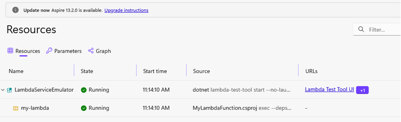
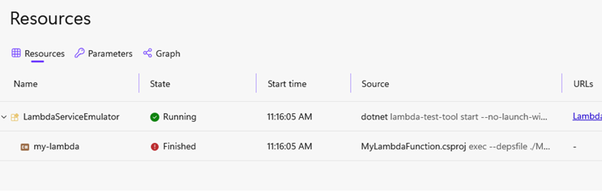

This repository contains a project for demonstrating the issue reported in https://github.com/dscpinheiro/AddAWSLambdaFunctionRepro

Before Aspire 13.2 (using `13.1.3`): 



Using `13.2.0`:



Logs:
```
Unable to proceed with project 'C:\Users\dspin\Desktop\AddAWSLambdaFunctionRepro\MyLambdaFunction\MyLambdaFunction.csproj'.                       
Ensure you have a runnable project type.                              
A runnable project should target a runnable TFM (for instance, net10.0) and have OutputType 'Exe'.
The current OutputType is 'Library'.
```